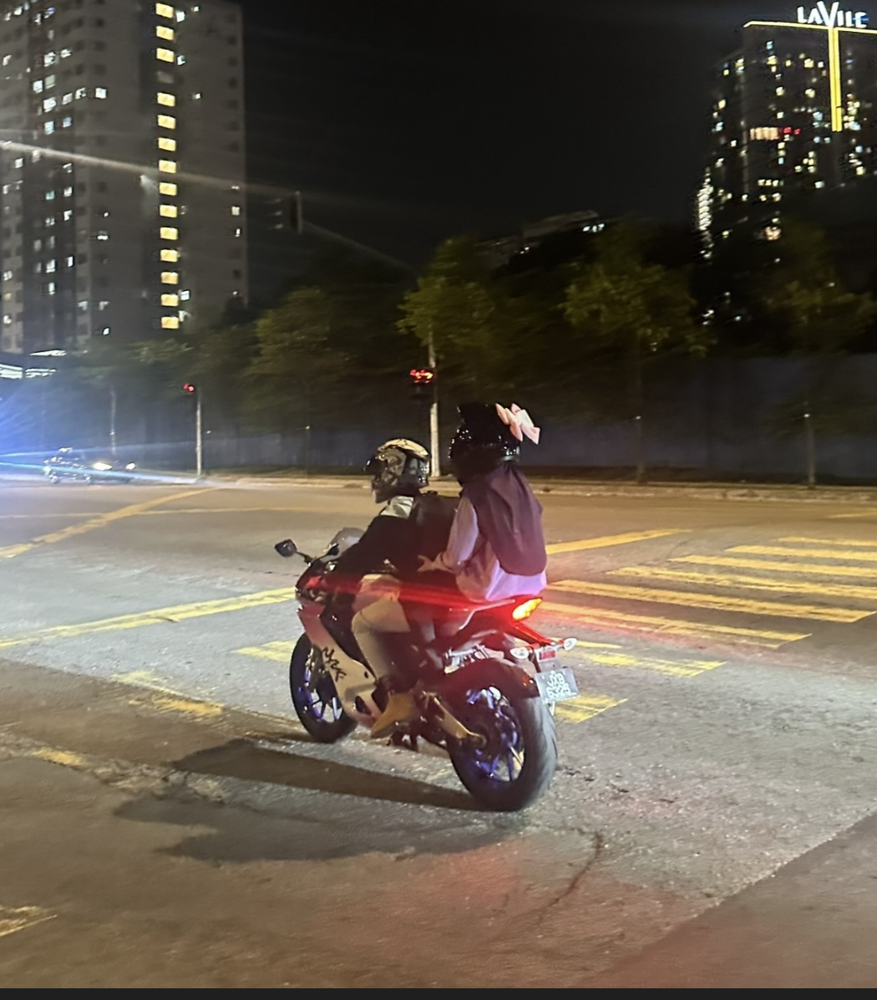
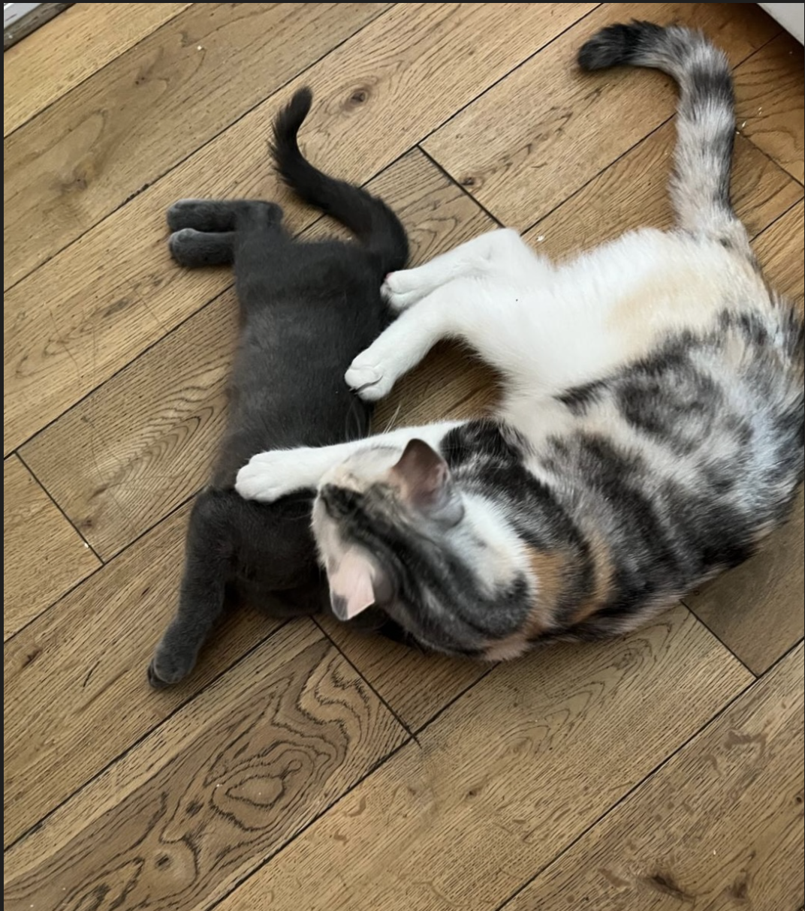
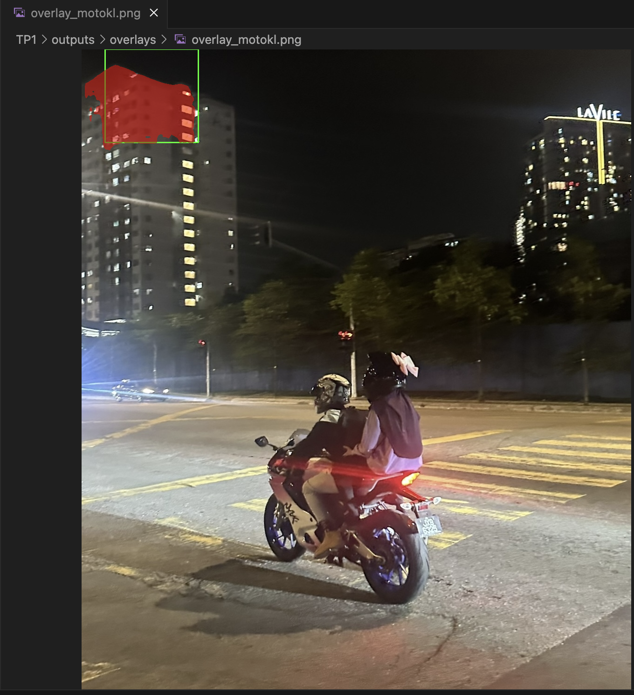
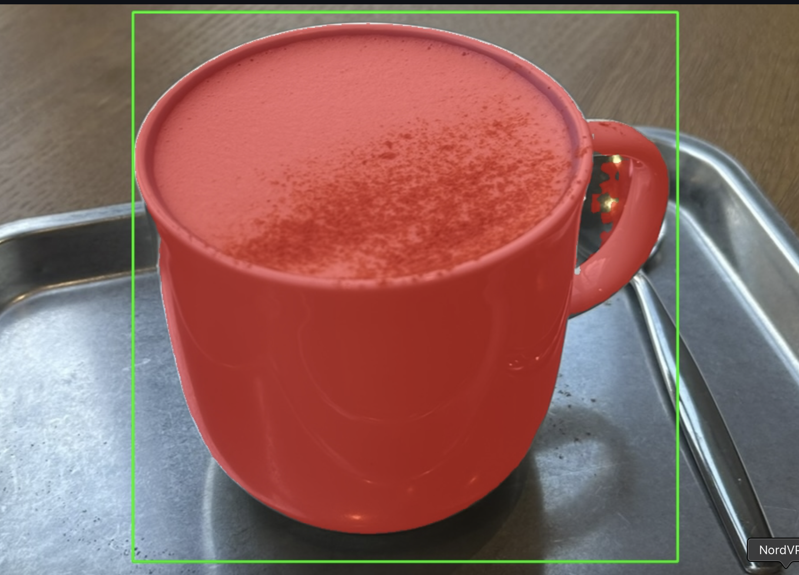
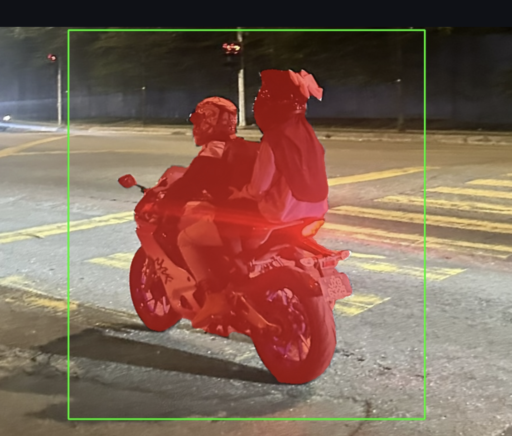
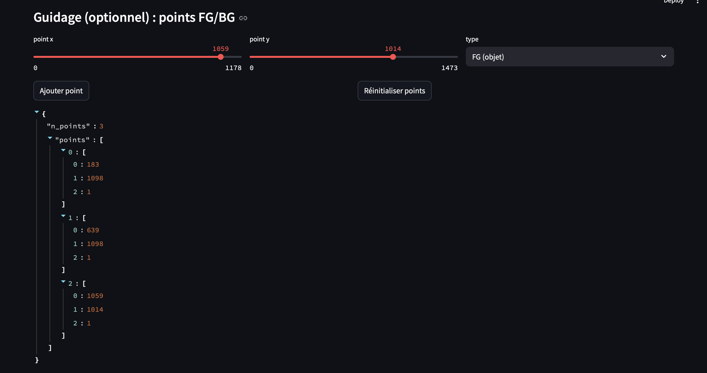

# RAPPORT TP Modern Computer Vision
Hanna HADDAOUI

## Dépôt
Lien : https://github.com/hannahadd/TP-CSC8608

## Environnement d’exécution
- Exécution : local

## Arborescence (aperçu)
TP1/
  data/images/
  src/
  outputs/overlays/
  outputs/logs/
  report/rapportTP1.md
  requirements.txt
  README.md


## Exercice 1

- Exécution : local (Mac)
- SLURM : non (commande `srun` indisponible en local)
- Torch : 2.10.0
- CUDA : cuda_available=False, device_count=0
- MPS : mps_available=True

Vérification imports :
- `import streamlit, cv2, numpy` OK
- `import segment_anything` OK (`sam_ok`)

sam ok: 
UI :

- Port : 8511
- UI accessible en local : oui (http://localhost:8511)



## Exercice 2: choix des photos 


explication de choix: 

cas simple: 2 chats sur fond uni 


Ici c'est intermediaire: on voit bien la moto mais il ya quand même assez d'informations à l'arrière 


Ici on a peu de contraste et l'inclinaison de l'objet le rend difficile à détecter:

## Exercice 3

Modèle / checkpoint
- model_type : `vit_b`
- checkpoint : `sam_vit_b_01ec64.pth` (stocké en local dans `TP1/models/`, non commité)

Test rapide (console)
```text
img (1474, 1179, 3) mask (1474, 1179) score 0.895150899887085 mask_sum 29451
```

Premier constat 
Le chargement et l’inférence fonctionnent : on obtient bien un masque binaire de même taille que l’image et un score cohérent (~0.895).
En exécution locale, pas de CUDA : les temps peuvent devenir sensibles sur de grandes images (ici 1474×1179), même si MPS aide.
La qualité dépend fortement de la bbox : une bbox trop large risque d’inclure du fond/objets voisins, trop serrée peut “couper” l’objet.

## Exercice 4
Overlay crée 


Métriques pour 3 images:
| image | score | area_px | perimeter |
|---|---:|---:|---:|
| motokl.jpg | 0.895 | 29451 | 889.31 |
| bottes.jpg | 0.768 | 31584 | 1162.08 |
| chailatte.jpg | 0.879 | 32405 | 1004.12 |


En quoi l’overlay aide à “debugger” ?
L’overlay rend visible immédiatement si la bbox guide bien SAM vers l’objet visé.  
Dans une scène chargée (rue de nuit), une bbox placée “au mauvais endroit” segmente facilement une texture dominante (façade, fenêtres éclairées) plutôt que l’objet d’intérêt.  
On voit aussi les “fuites” du masque sur le fond quand plusieurs éléments ressemblent (lumières, contours forts).  
En pratique, l’overlay aide à ajuster la bbox (plus centrée / plus large / moins large) et à détecter les cas ambigus qui nécessiteront des points FG/BG à l’exercice suivant.


## Exercice 5

Tasse chai latte:


Moto KL



Ordinateur:


Résultats des 3 tests 
| image | bbox (x1,y1,x2,y2) | score | area_px | time_ms |
|---|---|---:|---:|---:|
| chailatte.jpg | [347, 510, 962, 1131] | 1.001 | 247821 | 1743.6 |
| motokl.jpg | [286, 632, 897, 1299] | 0.973 | 129756 | 1541.9 |
| ordi.jpg | [0, 523, 964, 1465] | 0.974 | 496504 | 1588.0 |

### Debug — effet de la taille de la bbox
Quand j’agrandis la bbox, SAM a plus de contexte mais aussi plus d’éléments “candidats” : sur des scènes chargées, le masque peut déborder sur le fond ou inclure des objets voisins.  
Quand je rétrécis trop la bbox, l’objet est tronqué et la segmentation devient partielle (SAM colle à une sous-partie ou coupe des zones importantes).  
Une bbox “idéale” est généralement légèrement plus grande que l’objet et bien centrée : elle stabilise le masque et réduit les fuites.  
Sur les cas ambigus, ajuster la bbox ne suffit pas toujours : c’est là que l’ajout de points FG/BG (exercice suivant) devient nécessaire pour forcer la sélection du bon objet.


## Exercice 6

JETSKI



problème: detecte les rochers à l'arrière
=> on ajoute des points 


résultat:


il faufrait soit ajouter des points (mais laborieux sur le site, car on ne voit pas le curseur), donc oon pourrait juste retrecir la boite 

PLANCHE DE SURF:


J'ajoute les points:


On a un resulat plutôt satisfaisant, il détecte bien tout malgré le faible contraste, mais il prend aussi un bout du reflet du soleil. 
 
Détail des points:

{"image":"plagesurf.jpg","box_xyxy":[0,652,1178,1281],"points":[[592,907,1],[558,907,1],[558,841,1],[558,757,1],[558,855,1],[558,907,1],[558,976,1],[506,948,1],[464,948,1],[422,948,1],[386,948,1],[333,948,1],[281,910,1],[281,935,1]],"mask_idx":1,"score":0.9370172619819641,"area_px":40498,"mask_bbox":[166,730,1001,1408],"perimeter":1719.3422682285309,"time_ms":1685.9261989593506}

Les points FG/BG améliorent clairement le contrôle : un point FG sur l’objet force SAM à privilégier le bon candidat parmi les masques multimask, ce qui aide beaucoup quand plusieurs objets sont dans la bbox.  
Les points BG deviennent indispensables dès qu’il faut exclure une zone précise : fond très texturé, objet voisin similaire, ou “fuites” du masque sur des régions proches (ex : vitres, reflets, zones lumineuses).  
En pratique, FG + BG permet de corriger rapidement une segmentation “plausible mais mauvaise” et de converger vers l’objet attendu sans retoucher le modèle.  
Cependant, quand l’image contient beaucoup de détails fins (câbles, cheveux, grillage, reflets/transparence) ou des contours peu contrastés, la segmentation reste difficile : même avec des points, SAM peut hésiter entre plusieurs partitions valides ou produire un masque incomplet.  
Dans ces cas, il faut souvent multiplier les points (plusieurs BG) et ajuster la bbox, mais certaines ambiguïtés restent intrinsèquement complexes sans post-traitement ou données/contraintes supplémentaires.

## Exercice 7

### Trois facteurs principaux d’échec + actions concrètes
Les échecs viennent d’abord de la bounding box : dès qu’elle est trop large, mal centrée, ou qu’elle englobe plusieurs objets, SAM segmente un “candidat” cohérent mais pas forcément celui visé, surtout sur des scènes chargées. Ensuite, certaines images restent intrinsèquement difficiles : objets fins, faible contraste, reflets/transparence et occlusions provoquent des fuites du masque ou des segments incomplets. Enfin, le multimask peut proposer plusieurs solutions plausibles et le meilleur score n’est pas toujours celui qui correspond à l’intention utilisateur, notamment quand le fond est très texturé. Pour améliorer ça de manière actionnable, je renforcerais l’UI avec des contraintes et aides sur la bbox (warning si trop large/petite, preset “bbox serrée”, preview systématique), j’encouragerais l’ajout de points FG/BG (et je guiderais l’utilisateur quand le masque déborde), et j’ajouterais un post-traitement simple mais robuste (suppression de petites composantes, comblement de trous, choix de la plus grande composante si pertinent). Je constituerais aussi un mini-dataset ciblé sur ces cas difficiles pour tester à chaque modification et éviter les régressions.

### Industrialisation : quoi logger et monitorer en priorité

Pour industrialiser la brique, je loggerais systématiquement tout ce qui permet de rejouer un cas et d’expliquer un échec : l’identifiant et un hash de l’image, sa taille, la bbox exacte, la liste des points FG/BG, ainsi que le masque choisi (index) et les scores multimask. Je tracerais aussi la configuration d’inférence (model_type, version du checkpoint, device CPU/MPS/CUDA, versions des dépendances) afin de détecter des changements de comportement liés à l’environnement. Côté monitoring, je suivrais la latence totale et, si possible, la mémoire, parce que c’est le premier endroit où une régression se voit en production. Je monitorerais des signaux simples sur le masque (aire, bbox du masque, périmètre, ratio aire/bbox) pour repérer des dérives typiques comme des masques systématiquement trop grands ou trop petits. Enfin, je suivrais des indicateurs d’usage et de friction (taux de masques vides, erreurs, nombre de resets de points, nombre moyen de points ajoutés) car ils révèlent rapidement quand les images réelles changent ou quand l’outil devient moins fiable, même si le modèle n’a pas bougé.