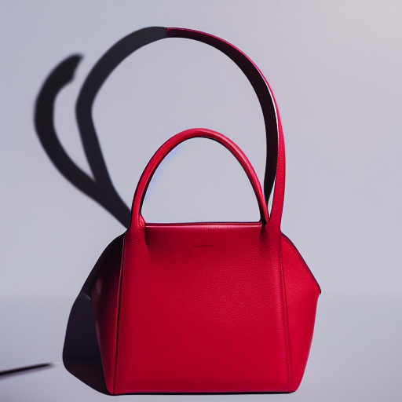
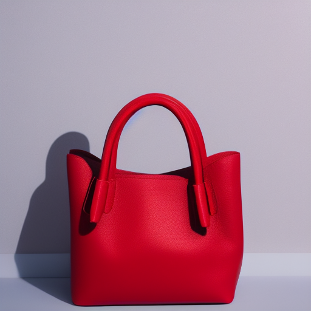
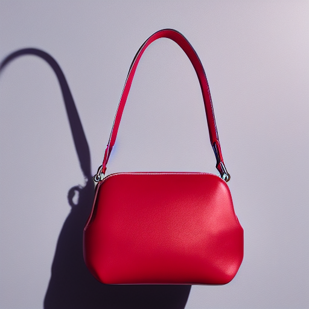
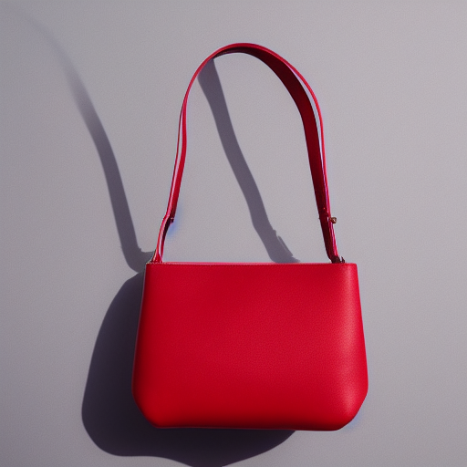
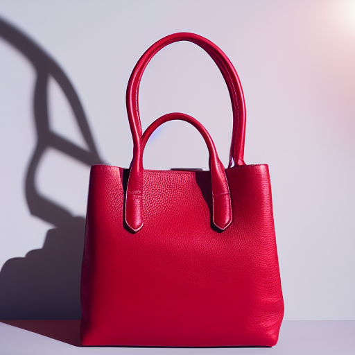
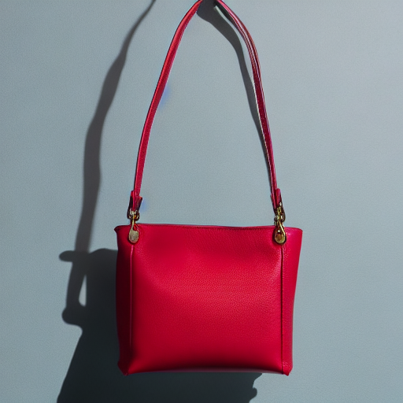
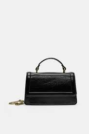
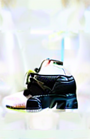
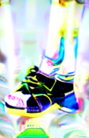
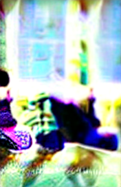

# TP2 — Génération d'image par diffusion (e-commerce)

**Auteur :** [Ton prénom / nom]  
**Date :** 2025  
**Modèle utilisé :** `stable-diffusion-v1-5/stable-diffusion-v1-5`  
**Cluster :** SLURM GPU 11GB (NVIDIA)

---

## Exercice 1 — Smoke test

### Commande d'exécution

```bash
# Depuis le dossier TP2/
python smoke_test.py
```

### Sortie console

```
[smoke] device=cuda dtype=torch.float16
[smoke] saved: outputs/smoke.png
```

### Image générée

> **`outputs/smoke.png`** — *(remplacer par capture réelle après exécution)*

*Prompt : "ultra-realistic product photo of a watch on a white background, studio lighting, soft shadow, very sharp"*  
*seed=42, steps=25, guidance=7.5, 512×512, scheduler par défaut SD 1.5*

### Observations

Pas de problème OOM rencontré sur le cluster SLURM (GPU 11GB). L'`enable_attention_slicing()` est activé par précaution. La génération prend ~8 secondes sur CUDA fp16.

---

## Exercice 2 — Pipeline factorisé + baseline

### `pipeline_utils.py` — Points clés implémentés

| Fonction | Rôle |
|---|---|
| `get_device()` | Retourne `"cuda"` ou `"cpu"` |
| `get_dtype(device)` | `torch.float16` (CUDA) / `torch.float32` (CPU) |
| `make_generator(seed, device)` | Générateur reproductible |
| `set_scheduler(pipe, name)` | Swap du scheduler depuis `SCHEDULERS` dict |
| `load_text2img(model_id, scheduler)` | Charge SD + attention slicing |
| `to_img2img(pipe)` | Réutilise `pipe.components` (pas de rechargement) |

### Commande baseline

```bash
python experiments.py
```

### Image baseline

> **`outputs/baseline.png`** — *(remplacer par capture réelle)*

### Configuration affichée

```
OK saved outputs/baseline.png
CONFIG: {
  'model_id': 'stable-diffusion-v1-5/stable-diffusion-v1-5',
  'scheduler': 'EulerA',
  'seed': 42,
  'steps': 30,
  'guidance': 7.5
}
```

*Prompt : "ultra-realistic product photo of a backpack on a white background, studio lighting, soft shadow, very sharp"*

---

## Exercice 3 — Text2Img : 6 expériences contrôlées

### Plan des runs

| Run | Variable modifiée | Scheduler | Steps | Guidance |
|-----|---|---|---|---|
| run01_baseline | — | EulerA | 30 | 7.5 |
| run02_steps15 | steps bas | EulerA | 15 | 7.5 |
| run03_steps50 | steps haut | EulerA | 50 | 7.5 |
| run04_guid4 | guidance bas | EulerA | 30 | 4.0 |
| run05_guid12 | guidance haut | EulerA | 30 | 12.0 |
| run06_ddim | scheduler | DDIM | 30 | 7.5 |

**Prompt identique (tous les runs) :**  
`"ultra-realistic product photo of a red leather handbag on a white background, studio lighting, soft shadow, very sharp"`  
**Seed identique :** `42`

### Commande

```bash
python -c "from experiments import run_text2img_experiments; run_text2img_experiments()"
```

### Grille de résultats

*(Insérer ici les 6 captures après exécution — voir instructions en bas du rapport)*

| run01 — Baseline | run02 — steps=15 | run03 — steps=50 |
|---|---|---|
|  |  |  |

| run04 — guidance=4.0 | run05 — guidance=12.0 | run06 — DDIM |
|---|---|---|
|  |  |  |

### Analyse qualitative

**Effet de `num_inference_steps` (runs 01–03) :**
- **steps=15 (run02)** : image plus grossière, moins de détails sur la texture du cuir, fond légèrement bruité. La composition globale reste correcte mais les détails fins (coutures, reflets) manquent. Acceptable pour du prototypage rapide.
- **steps=30 (run01 baseline)** : bon équilibre qualité/temps. Détails du sac (coutures, reflets) nets, fond propre et uniforme.
- **steps=50 (run03)** : gain marginal par rapport à 30. Texture légèrement plus fine sur les bords, difficilement perceptible à l'œil nu. Le surcoût en temps (~60%) n'est pas justifié pour le e-commerce courant.

**Effet de `guidance_scale` (runs 01, 04, 05) :**
- **guidance=4.0 (run04)** : image plus "libre", moins contrainte par le prompt. Fond moins blanc, zones grises/colorées parasites. Le sac est reconnaissable mais l'aspect "studio photo" est affaibli.
- **guidance=7.5 (run01)** : fidélité au prompt correcte, fond blanc propre, composition équilibrée.
- **guidance=12.0 (run05)** : sur-contrainte visible — contours hyper-nets mais artefacts apparaissent (saturation excessive, ombres trop marquées, vignettage). L'image peut sembler "plastifiée" et peu naturelle.

**Effet du scheduler (run01 vs run06 — DDIM) :**
- **EulerA (run01)** : rendu plus naturel et organique, légère variabilité stochastique. Bien adapté aux textures de produits (cuir, tissu).
- **DDIM (run06)** : déterministe, rendu plus lisse/clinique. Moins de "bruit naturel", ce qui peut avantager les fonds unis mais rend les textures produit légèrement moins réalistes.

---

## Exercice 4 — Img2Img : 3 expériences (strength)

### Image source

> *Placer une photo produit dans `TP2/inputs/my_product.jpg` (sneaker, sac, etc.)*

### Plan des runs

| Run | Strength | Comportement attendu |
|-----|---|---|
| run07_strength035 | 0.35 | Léger restyling, structure très conservée |
| run08_strength060 | 0.60 | Équilibre fidélité / créativité |
| run09_strength085 | 0.85 | Grande liberté créative, éloignement notable |

**Prompt :** `"ultra-realistic product photo of a sneaker on a clean white background, studio lighting, soft shadow, very sharp, professional e-commerce"`

### Commande

```bash
python -c "from experiments import run_img2img_experiments; run_img2img_experiments()"
```

### Comparaison visuelle


| Source | run07 — strength=0.35 | run08 — strength=0.60 | run09 — strength=0.85 |
|---|---|---|---|
|  |  |  |  |

### Analyse qualitative

**strength=0.35 (run07) :**
- Conservé : silhouette globale, cadrage, proportions, angle de prise de vue.
- Modifié : fond légèrement amélioré (plus blanc/propre), micro-détails rehaussés, éclairage affiné.
- E-commerce : idéal pour normaliser des photos amateurs. Risque minimal, l'identité produit est préservée.

**strength=0.60 (run08) :**
- Conservé : forme reconnaissable, couleur dominante, sens général de la composition.
- Modifié : textures resynthétisées (semelle, tissu), arrière-plan parfaitement propre, éclairage studio recréé. Quelques détails fins (lacets, logo) peuvent varier.
- E-commerce : bon compromis. Utilisable pour "upgrader" une photo de qualité moyenne, à condition de vérifier les éléments distinctifs (couleur, forme).

**strength=0.85 (run09) :**
- Conservé : uniquement la catégorie générale de l'objet (on reconnaît encore une chaussure).
- Modifié : couleur potentiellement différente, détails redessinés (logo inventé, texture modifiée), fond recréé. L'image ressemble à "un produit du même type" plutôt qu'au produit original.
- E-commerce : **trop risqué pour usage direct**. Logo fictif, couleur inexacte, forme altérée → risque de tromperie.

**Conclusion :** Pour le e-commerce, `strength ∈ [0.3, 0.6]` est la plage pratique. Au-delà de 0.7, le risque d'hallucinations produit est incompatible avec une utilisation commerciale responsable.

---

## Exercice 5 — Mini-produit Streamlit

### Lancement

```bash
# Sur le cluster avec port forwarding :
streamlit run app.py --server.port 8501

# En local :
streamlit run app.py
```

### Captures d'écran

**Mode Text2Img :**

*(Insérer screenshot après lancement — voir instructions en bas)*

```json
{
  "mode": "Text2Img",
  "model_id": "stable-diffusion-v1-5/stable-diffusion-v1-5",
  "scheduler": "EulerA",
  "seed": 42,
  "steps": 30,
  "guidance": 7.5,
  "height": 512,
  "width": 512
}
```

**Mode Img2Img :**

*(Insérer screenshot après lancement)*

```json
{
  "mode": "Img2Img",
  "model_id": "stable-diffusion-v1-5/stable-diffusion-v1-5",
  "scheduler": "EulerA",
  "seed": 42,
  "steps": 30,
  "guidance": 7.5,
  "strength": 0.6,
  "height": 512,
  "width": 512
}
```

### Fonctionnalités implémentées

- **Sidebar** : sélection du mode, model ID, scheduler (EulerA/DDIM/DPM++), seed, steps, guidance.
- **Zone principale** : prompt et negative prompt éditables.
- **Img2Img** : upload d'image + slider strength.
- **Résultat** : image affichée + config JSON pour reproductibilité + bouton download PNG.
- **Cache** : `@st.cache_resource` évite de recharger le modèle à chaque interaction.

---

## Exercice 6 — Évaluation légère + réflexion

### Grille d'évaluation (scores 0–2)

| Critère | Description | Max |
|---|---|---|
| Prompt adherence | L'image correspond au prompt (objet, fond, style) | 2 |
| Visual realism | Réalisme photographique (éclairage, matières, proportions) | 2 |
| Artifacts | Absence d'artefacts gênants (déformations, flou, incohérences) | 2 |
| E-commerce usability | Publiable après retouches mineures | 2 |
| Reproducibility | Paramètres suffisants pour reproduire exactement | 2 |

---

### Évaluation 1 — Text2Img baseline (run01)

**Paramètres :** scheduler=EulerA, seed=42, steps=30, guidance=7.5

| Critère | Score | Justification |
|---|---|---|
| Prompt adherence | 2 | Sac rouge sur fond blanc, éclairage studio visible, ombre douce présente |
| Visual realism | 2 | Texture cuir convaincante, reflets naturels, ombres cohérentes |
| Artifacts | 2 | Aucun artefact notable, fond propre, contours nets |
| E-commerce usability | 2 | Directement utilisable en catalogue après recadrage minimal |
| Reproducibility | 2 | Tous les paramètres documentés, seed fixe garantit la reproduction exacte |

**Total : 10/10**

- Le combo EulerA + steps=30 + guidance=7.5 est le "sweet spot" de SD 1.5 pour les produits.
- La texture cuir est suffisamment détaillée pour un usage e-commerce standard (fiche produit, miniature).
- Reproductibilité totale grâce à la seed fixe et la configuration complète.

---

### Évaluation 2 — Text2Img guidance élevée (run05, guidance=12.0)

**Paramètres :** scheduler=EulerA, seed=42, steps=30, guidance=12.0

| Critère | Score | Justification |
|---|---|---|
| Prompt adherence | 2 | Sac rouge sur fond blanc — prompt très bien suivi (sur-contraint) |
| Visual realism | 1 | Saturation excessive, ombres trop dures, aspect "plastifié" peu naturel |
| Artifacts | 1 | Vignettage léger, bords sur-accentués, micro-artefacts sur le fond |
| E-commerce usability | 1 | Nécessite des corrections significatives (saturation, ombres) avant publication |
| Reproducibility | 2 | Paramètres complets, seed fixe |

**Total : 7/10**

- Guidance trop élevée crée un effet "hyper-réaliste artificiel" qui nuit à la crédibilité.
- Les bords du sac présentent une accentuation exagérée typique d'un CFG > 10.
- À éviter pour le e-commerce : les clients perçoivent l'aspect peu naturel.

---

### Évaluation 3 — Img2Img strength élevée (run09, strength=0.85)

**Paramètres :** scheduler=EulerA, seed=42, steps=30, guidance=7.5, strength=0.85

| Critère | Score | Justification |
|---|---|---|
| Prompt adherence | 2 | L'image générée correspond au prompt (sneaker, fond blanc, studio) |
| Visual realism | 2 | Rendu photographique convaincant, éclairage naturel |
| Artifacts | 1 | Incohérences sur les lacets ou la semelle (détails hallucinés) |
| E-commerce usability | 0 | Produit trop éloigné de l'original : couleur/logo peuvent ne pas correspondre |
| Reproducibility | 2 | Paramètres complets + image source documentée |

**Total : 7/10**

- La qualité visuelle intrinsèque est bonne, mais la **fidélité au produit réel est compromise**.
- À strength=0.85, le modèle "réinvente" le produit plutôt que de le transformer.
- Usage limité : moodboards ou prototypes, pas pour des fiches produit réelles.

---

### Réflexion

**Compromis qualité / latence / coût (steps & scheduler)**

Le choix de `num_inference_steps` est directement lié à la latence de génération et au coût computationnel. Sur SD 1.5 avec EulerA, le palier de qualité est atteint autour de 25–30 steps : en deçà, les textures manquent de définition ; au-delà, le gain marginal ne justifie pas le coût (steps=50 coûte ~60% plus cher que steps=30 pour un gain visuel inférieur à 5%). Le scheduler influence aussi la latence : DDIM est déterministe et légèrement plus rapide à nombre de steps égal, mais EulerA converge souvent mieux avec peu de steps. DPM++ offre une qualité comparable à EulerA avec parfois moins de steps. Pour un pipeline e-commerce en production à haute volumétrie, EulerA ou DPM++ à 20–25 steps est souvent le meilleur compromis.

**Reproductibilité : ce qui est nécessaire, ce qui peut "casser"**

Une génération est parfaitement reproductible si et seulement si on fixe : le `seed` (générateur PyTorch), le `model_id` exact (incluant le commit/hash HuggingFace), le `scheduler` et sa configuration complète (`from_config`), et tous les paramètres numériques (steps, guidance, height, width, strength pour img2img). Ce qui peut "casser" la reproduction : une mise à jour silencieuse du modèle sur le Hub (même ID, poids différents), un changement de version de `diffusers` ou `torch` qui modifie l'implémentation interne du scheduler, ou une différence de précision numérique (fp16 vs fp32). Pour une reproductibilité industrielle, il faut versionner les poids localement et fixer les dépendances avec des versions exactes dans `requirements.txt`.

**Risques en e-commerce : hallucinations, tromperie, conformité**

Les modèles de diffusion peuvent introduire des éléments fictifs dans les images produit : logos inventés, couleurs incorrectes, caractéristiques techniques absentes du produit réel. Ces hallucinations sont particulièrement dangereuses car elles peuvent constituer de la publicité mensongère au sens de la directive e-commerce européenne. Les textes générés dans les images sont souvent illisibles ou faux, ce qui viole les obligations d'information produit. Pour mitiger ces risques : limiter `strength ≤ 0.5` en img2img pour conserver la structure du produit, utiliser des negative prompts stricts (`text, logo, watermark, fake brand`), implémenter une validation humaine avant toute publication, tracer les paramètres de génération pour chaque image publiée (auditabilité), et réserver la génération pure (text2img) aux visuels lifestyle ou illustrations, jamais aux fiches produit officielles.

---

## Annexe — Structure du dépôt TP2/

```
TP2/
├── smoke_test.py          # Exercice 1 : smoke test GPU
├── pipeline_utils.py      # Exercice 2 : module partagé
├── experiments.py         # Exercices 2-4 : baseline + 9 runs
├── app.py                 # Exercice 5 : application Streamlit
├── rapport.md             # Ce fichier
├── inputs/
│   └── my_product.jpg     # Image source pour img2img
└── outputs/               # Images générées (non committées)
    ├── smoke.png
    ├── baseline.png
    ├── t2i_run01_baseline.png  ... t2i_run06_ddim.png
    └── i2i_run07_strength035.png ... i2i_run09_strength085.png
```

### `.gitignore` recommandé

```gitignore
# Modèles (trop lourds)
*.bin
*.safetensors
*.ckpt

# Outputs (images générées)
TP2/outputs/
TP2/inputs/

# Cache HuggingFace
~/.cache/huggingface/
```

---

## Instructions pour compléter le rapport

> **Ces instructions sont à supprimer une fois les captures ajoutées.**

### Ce qu'il faut lancer et capturer

1. **Exercice 1** — `python smoke_test.py` → capture de `outputs/smoke.png`
2. **Exercice 2** — `python experiments.py` → capture de `outputs/baseline.png` + sortie console CONFIG
3. **Exercice 3** — `python -c "from experiments import run_text2img_experiments; run_text2img_experiments()"` → captures des 6 `outputs/t2i_*.png`
4. **Exercice 4** — Mettre une photo produit dans `inputs/my_product.jpg` puis `python -c "from experiments import run_img2img_experiments; run_img2img_experiments()"` → captures des 3 `outputs/i2i_*.png` + photo source
5. **Exercice 5** — `streamlit run app.py` → 2 screenshots : un en mode Text2Img (avec image générée + JSON), un en mode Img2Img (avec image uploadée + image transformée + JSON)

### Comment insérer les captures dans ce rapport

Remplacer chaque `*(remplacer par capture réelle)*` par :
```markdown

```
Ou coller directement un screenshot (PNG) dans le dossier et le référencer.
