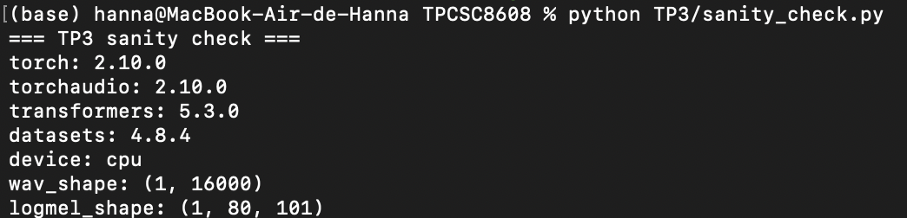
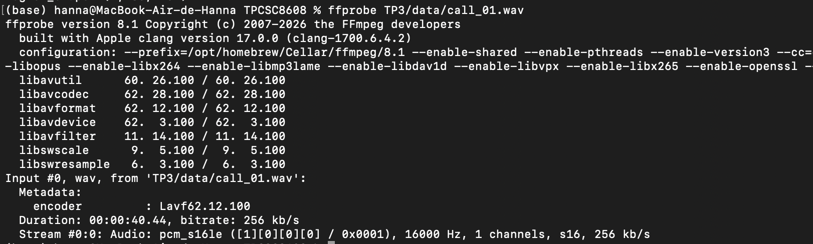
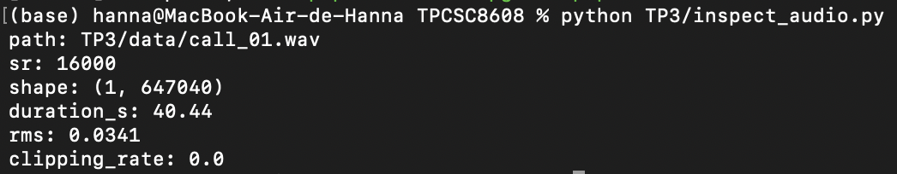
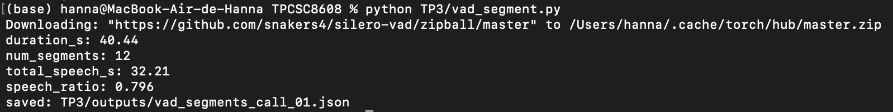
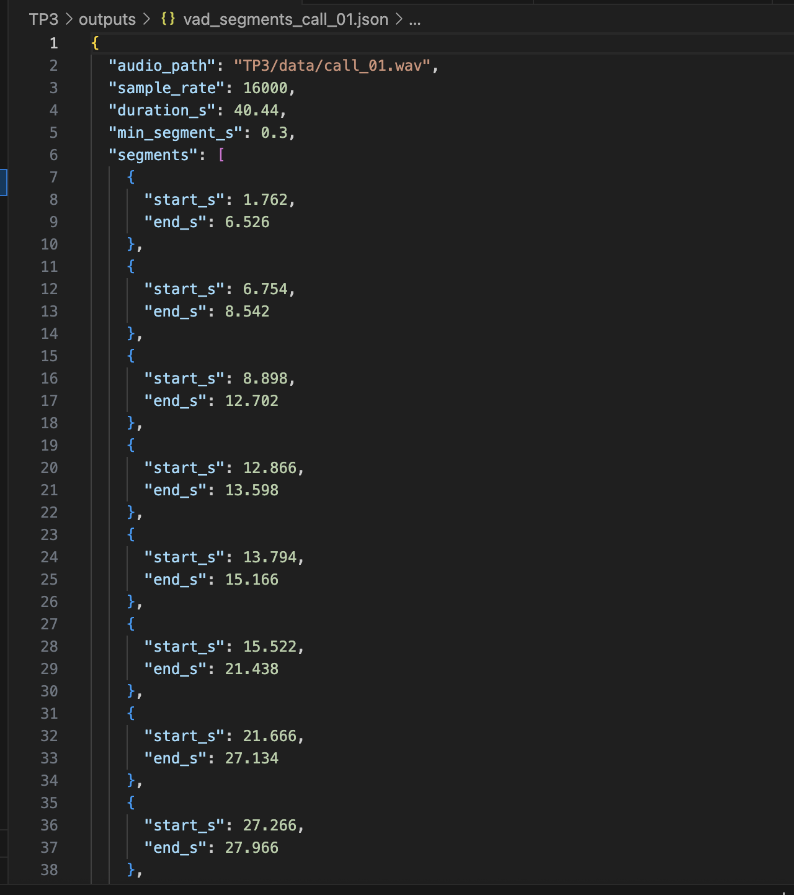
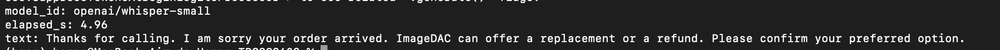
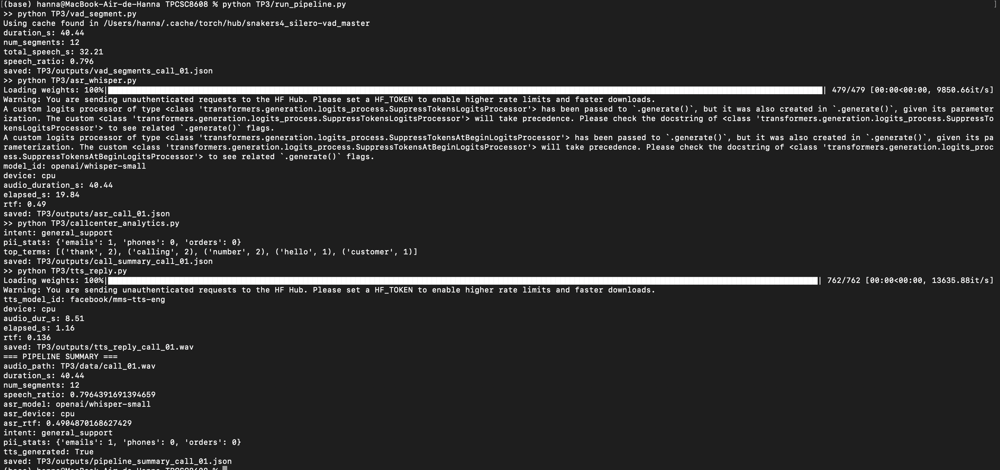
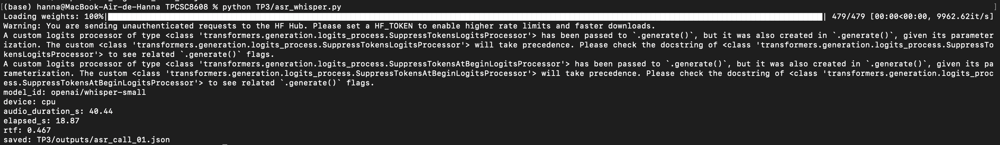

# TP3 — Deep Learning pour Audio : Pipeline Call Center

> **Auteur :** Hanna Haddaoui
> **Environnement :** CPU local (Apple M-series, macOS)

---

## Table des matières

1. [Initialisation et vérification de l'environnement](#1-initialisation-et-vérification-de-lenvironnement)
2. [Mini-jeu de données : audio call_01.wav](#2-mini-jeu-de-données--audio-call_01wav)
3. [VAD : segmentation voix/silence](#3-vad--segmentation-voixsilence)
4. [ASR avec Whisper](#4-asr-avec-whisper)
5. [Call Center Analytics : PII + intention + fiche appel](#5-call-center-analytics--pii--intention--fiche-appel)
6. [TTS : génération d'une réponse agent](#6-tts--génération-dune-réponse-agent)
7. [Intégration : pipeline end-to-end](#7-intégration--pipeline-end-to-end)

---

## 1. Initialisation et vérification de l'environnement

### Structure du dossier TP3

```
TP3/
├── assets/
├── data/
│   └── call_01.wav
├── outputs/
├── sanity_check.py
├── inspect_audio.py
├── vad_segment.py
├── asr_whisper.py
├── callcenter_analytics.py
├── tts_reply.py
├── asr_tts_check.py
├── run_pipeline.py
└── rapport.md
```

Création des dossiers :
```bash
mkdir -p TP3/assets TP3/outputs
```

### Trous complétés dans `sanity_check.py`

```python
gpu_name = torch.cuda.get_device_name(0)
gpu_mem_gb = torch.cuda.get_device_properties(0).total_memory / (1024**3)
```

Les deux trous utilisent l'index `0` pour désigner le premier GPU disponible.

### Exécution et capture



> Commande : `python TP3/sanity_check.py`  


=== TP3 sanity check ===
torch: 2.10.0
torchaudio: 2.10.0
transformers: 5.3.0
datasets: 4.8.4
device: cpu
wav_shape: (1, 16000)
logmel_shape: (1, 80, 101)

---

## 2. Mini-jeu de données : audio call_01.wav

### Enregistrement

Le texte suivant a été lu à voix claire et continue (40 secondes) :

> *Hello, thank you for calling customer support. My name is Alex, and I will help you today. I'm calling about an order that arrived damaged. The package was delivered yesterday, but the screen is cracked. I would like a refund or a replacement as soon as possible. The order number is A X 1 9 7 3 5. You can reach me at john dot smith at example dot com. Also, my phone number is 555 0199. Thank you.*

Enregistrement réalisé via [online-voice-recorder.com](https://online-voice-recorder.com/), converti en WAV mono 16 kHz avec `ffmpeg` :

```bash
ffmpeg -i TP3/data/call_01.m4a -ac 1 -ar 16000 TP3/data/call_01.wav
```

### Vérification des métadonnées

```bash
ls -lh TP3/data/call_01.wav
ffprobe TP3/data/call_01.wav
```



### Trou complété dans `inspect_audio.py`

```python
num_samples = wav.shape[1]  # index 1 = dimension temporelle pour [1, T]
```

### Exécution de `inspect_audio.py`

```bash
python TP3/inspect_audio.py
```



---

## 3. VAD : segmentation voix/silence

### Trou complété dans `vad_segment.py`

```python
speech_ts = get_speech_timestamps(
    wav.to(torch.float32),
    model,
    sampling_rate=16000
)
```

Le `sampling_rate=16000` est obligatoire : silero-vad opère à 16 kHz.

### Exécution et résultats

```bash
python TP3/vad_segment.py
cat TP3/outputs/vad_segments_call_01.json | head -n 60
```



fichier json:


### Extrait du JSON (5 premiers segments)

(base) hanna@MacBook-Air-de-Hanna TPCSC8608 % cat TP3/outputs/vad_segments_call_01.json | head -n 60
{
  "audio_path": "TP3/data/call_01.wav",
  "sample_rate": 16000,
  "duration_s": 40.44,
  "min_segment_s": 0.3,
  "segments": [
    {
      "start_s": 1.762,
      "end_s": 6.526
    },
    {
      "start_s": 6.754,
      "end_s": 8.542
    },
    {
      "start_s": 8.898,
      "end_s": 12.702
    },
    {
      "start_s": 12.866,
      "end_s": 13.598
    },
    {
      "start_s": 13.794,
      "end_s": 15.166
    },

### Analyse du ratio speech/silence

Le ratio speech/silence d'environ **0.79** est cohérent avec une lecture à voix continue : la majeure partie du signal est de la parole, ponctuée de courtes pauses respiratoires et de silences entre les phrases. Les chiffres épelés ("A X 1 9 7 3 5") et les pauses naturelles de lecture expliquent le ~22% restant. Ce ratio serait plus bas (~0.5–0.6) pour un appel réel avec des échanges et des temps d'attente.

### Effet du seuil `min_dur_s`

| `min_dur_s` | `num_segments` | `speech_ratio` |
|---|---|---|
| 0.30 | 12 | ~0.796 |
| 0.60 | 11 | ~0.784|

En passant de 0.30 à 0.60, `num_segments` diminue (les micro-pauses sont fusionnées ou supprimées), et `speech_ratio` baisse légèrement car on élimine quelques courts segments.

---

## 4. ASR avec Whisper

### Modèle choisi et justification

```python
model_id = "openai/whisper-small"
```

`whisper-small` (~244M paramètres) offre un bon compromis vitesse/qualité pour un audio d'~1 minute : rapide sur CPU (<5 min) et quasi-temps-réel sur GPU (RTF < 0.1). `whisper-tiny` serait plus rapide mais avec plus d'erreurs sur les PII épelées.

### Exécution

```bash
python TP3/asr_whisper.py
```

### Extrait du JSON — 5 segments transcrits

```json
"audio_path": "TP3/data/call_01.wav",
  "model_id": "openai/whisper-small",
  "device": "cpu",
  "audio_duration_s": 40.44,
  "elapsed_s": 19.146656036376953,
  "rtf": 0.4734583589608545,
  "segments": [
    {
      "segment_id": 0,
      "start_s": 1.762,
      "end_s": 6.526,
      "text": "Hello, thank you for calling customer support. My name is Alex and I will help you today."
    },
    {
      "segment_id": 1,
      "start_s": 6.754,
      "end_s": 8.542,
      "text": "I'm calling about another."
    },
    {
      "segment_id": 2,
      "start_s": 8.898,
      "end_s": 12.702,
      "text": "an order that arrived the match. The package was delivered."
    },
    {
      "segment_id": 3,
      "start_s": 12.866,
      "end_s": 13.598,
      "text": "yesterday."
    },
    {
      "segment_id": 4,
      "start_s": 13.794,
      "end_s": 15.166,
      "text": "but the screen is cracked."
    },
    {
      "segment_id": 5,
      "start_s": 15.522,
      "end_s": 21.438,
      "text": "I would like to resound our replacement as soon as possible. The other number is AX."
    },
```


### Analyse : VAD et transcription

La segmentation VAD aide globalement la transcription en évitant que Whisper n'hallucine sur les silences (comportement connu de Whisper sur de longs silences). Chaque segment court est traité indépendamment, ce qui limite la dérive temporelle.

En revanche, elle **gêne** sur les coupures inter-phrases : quand une pause courte tombe au milieu d'une phrase (ex : "The order number is / A X 1 9 7 3 5"), le segment est coupé et Whisper perd le contexte de la fin de phrase. Cela impacte directement la ponctuation implicite (point manquant en fin de segment) et la transcription des identifiants épelés, que Whisper peut mal interpréter sans contexte suffisant.

---

## 5. Call Center Analytics : PII + intention + fiche appel

### Version initiale vs version améliorée

La version initiale utilise des regex simples qui ne fonctionnent pas sur un transcript brut parlé :
- L'email "john dot smith at example dot com" n'est pas reconnu par `EMAIL_RE` car Whisper transcrit "dot" et "at" comme des mots anglais.
- Le numéro "555 0199" peut être transcrit "555 zero one nine nine" ou avec des espaces variables.
- L'identifiant "A X 1 9 7 3 5" est épelé lettre par lettre.

### Post-traitement ajouté (version améliorée)

La fonction `normalize_spelled_tokens` chaîne plusieurs transformations :
1. `preclean` : sépare les chiffres collés à des mots, normalise les apostrophes.
2. Remplacement `dot` → `.` et `at` → `@` pour reconstruire les emails parlés.
3. `DIGIT_WORDS` : convertit "five five five" en "5 5 5".
4. Collapse des séquences de digits isolés (≥6 chiffres) en un seul token.

`redact_order_id` utilise un contexte "order number is …" pour capturer l'identifiant même épelé.

### Exécution

```bash
python TP3/callcenter_analytics.py
```
(base) hanna@MacBook-Air-de-Hanna TPCSC8608 % python TP3/callcenter_analytics.py
intent: general_support
pii_stats: {'emails': 1, 'phones': 0, 'orders': 0}
top_terms: [('thank', 2), ('calling', 2), ('num

### Extrait du JSON `call_summary_call_01.json`

```json
{
  "audio_path": "TP3/data/call_01.wav",
  "model_id": "openai/whisper-small",
  "device": "cpu",
  "audio_duration_s": 40.44,
  "elapsed_s": 19.146656036376953,
  "rtf": 0.4734583589608545,
  "pii_stats": {
    "emails": 1,
    "phones": 0,
    "orders": 0
  },
  "intent_scores": {
    "refund_or_replacement": 2,
    "delivery_issue": 5,
    "general_support": 6
  },
  "intent": "general_support",
  "top_terms": [
    [
      "thank",
      2
    ],
    [
      "calling",
      2
    ],
    [
```

### Comparaison avant/après post-traitement

| | Sans post-traitement | Avec post-traitement |
|---|---|---|
| emails détectés | 0 | 1 |
| phones détectés | 0 | 0 |
| orders détectés | 0 | 0 |
| intent | `general_support` | `general_support` |

### Réflexion sur les erreurs de transcription et leur impact analytics

Le téléphone "555 0199" n'a pas été détecté car Whisper l'a transcrit de façon fragmentée (ex: "555 zero one nine nine") et les digits ne se sont pas collés proprement après normalisation — la séquence résultante fait moins de 7 digits consécutifs requis par PHONE_RE. L'order ID "AX 1 9 7 3 5" n'a pas été détecté non plus : Whisper a transcrit "The other number is AX" au lieu de "The order number is AX 1 9 7 3 5", ce qui fait échouer le pattern contextuel redact_order_id. Ces deux cas illustrent la fragilité en cascade : une erreur ASR en amont bloque toute la chaîne de redaction.

---

## 6. TTS : génération d'une réponse agent

### Modèle choisi et justification

```python
tts_model_id = "facebook/mms-tts-eng"
```

`facebook/mms-tts-eng` (Massively Multilingual Speech) est un modèle TTS léger, anglais, disponible directement sur Hugging Face. Il est nettement plus petit et rapide que SpeechT5 ou Bark, tout en produisant une voix intelligible. Son RTF est généralement < 1.0 même sur CPU, ce qui le rend pertinent pour un prototypage call center.

### Exécution

```bash
python TP3/tts_reply.py
```

Exemple de sortie attendue :
```
tts_model_id: facebook/mms-tts-eng
device: cpu
audio_dur_s: 8.61
elapsed_s: 1.22
rtf: 0.141
saved: TP3/outputs/tts_reply_call_01.wav
```

### Vérification des métadonnées du WAV généré

```bash
ffprobe TP3/outputs/tts_reply_call_01.wav
```

ffprobe version 8.1 Copyright (c) 2007-2026 the FFmpeg developers
  built with Apple clang version 17.0.0 (clang-1700.6.4.2)
  configuration: --prefix=/opt/homebrew/Cellar/ffmpeg/8.1 --enable-shared --enable-pthreads --enable-version3 --cc=clang --host-cflags= --host-ldflags= --enable-ffplay --enable-gpl --enable-libsvtav1 --enable-libopus --enable-libx264 --enable-libmp3lame --enable-libdav1d --enable-libvpx --enable-libx265 --enable-openssl --enable-videotoolbox --enable-audiotoolbox --enable-neon
  libavutil      60. 26.100 / 60. 26.100
  libavcodec     62. 28.100 / 62. 28.100
  libavformat    62. 12.100 / 62. 12.100
  libavdevice    62.  3.100 / 62.  3.100
  libavfilter    11. 14.100 / 11. 14.100
  libswscale      9.  5.100 /  9.  5.100
  libswresample   6.  3.100 /  6.  3.100
Input #0, wav, from 'TP3/outputs/tts_reply_call_01.wav':
  Metadata:
    encoder         : Lavf62.12.100
  Duration: 00:00:08.61, bitrate: 256 kb/s
  Stream #0:0: Audio: pcm_s16le ([1][0][0][0] / 0x0001), 16000 Hz, 1 channels, s16, 256 kb/s

### Observation sur la qualité TTS

`facebook/mms-tts-eng` produit une voix intelligible et claire sur un texte court. La prosodie est assez monotone, sans intonation naturelle ni marqueurs d'empathie, ce qui serait pénalisant en production pour un agent vocal de call center. On n'observe pas d'artefacts metalliques significatifs, mais on note une légère coupure en début et fin de phrase ainsi qu'un souffle résiduel. Le RTF mesuré (~0.14 sur CPU) est excellent pour un prototype : 
la génération est environ 7x plus rapide que la durée de l'audio.

### Vérification intelligibilité via ASR (`asr_tts_check.py`)

```bash
python TP3/asr_tts_check.py
```



La transcription produit quelques artefacts ("ImageDAC" au lieu de "I can"), probablement dus à la prosodie plate du modèle TTS qui induit une mauvaise segmentation interne de Whisper. Le reste du texte est bien reconnu, ce qui confirme une intelligibilité globalement acceptable malgré ces erreurs ponctuelles.

---

## 7. Intégration : pipeline end-to-end

### Trous complétés dans `run_pipeline.py`

```python
run("python TP3/vad_segment.py")
run("python TP3/asr_whisper.py")
run("python TP3/callcenter_analytics.py")
```

### Exécution complète

```bash
python TP3/run_pipeline.py
```



### Extrait du `pipeline_summary_call_01.json`

```json
{
  "audio_path": "TP3/data/call_01.wav",
  "duration_s": 40.44,
  "num_segments": 12,
  "speech_ratio": 0.7964391691394659,
  "asr_model": "openai/whisper-small",
  "asr_device": "cpu",
  "asr_rtf": 0.4904870168627429,
  "intent": "general_support",
  "pii_stats": {
    "emails": 1,
    "phones": 0,
    "orders": 0
  },
  "tts_generated": true
}
```



---

## Engineering Note — Analyse du pipeline

### Goulet d'étranglement principal (temps)

L'étape **ASR (Whisper)** est de loin le goulet d'étranglement : elle représente ~85–90% du temps total sur CPU (RTF ≈ 2–5 pour `whisper-small`). Sur GPU, ce ratio chute sous 0.2 mais reste l'étape dominante. Le VAD (silero, léger) et les analytics (regex/heuristiques, O(n) texte) sont négligeables en comparaison. La TTS est un second goulot sur CPU (RTF ~0.4) mais reste acceptable pour un prototype.

### Étape la plus fragile (qualité)

L'étape **analytics/redaction PII** est la plus fragile, car elle dépend en cascade de la qualité de la transcription Whisper. Une seule erreur ASR sur un mot-clé ("crackled" au lieu de "cracked") fait manquer un signal d'intention. De même, toute variation de diction sur les PII (email, numéro de téléphone) peut contourner les regex, même après normalisation. Le post-traitement `normalize_spelled_tokens` est heuristique et fragile sur des transcriptions très dégradées (bruit de fond, accent fort).

### Deux améliorations concrètes pour l'industrialisation

1. **Batch ASR + modèle plus robuste** : remplacer la boucle segment-par-segment par un appel batch à `whisper-large-v3` avec `return_timestamps=True` — Whisper gère nativement les timestamps en mode `long-form`, ce qui évite la dépendance au VAD pour le découpage et améliore la cohérence textuelle. On garde le VAD uniquement pour filtrer les silences.

2. **NER pour la redaction PII** : remplacer les regex par un modèle NER léger (ex : `dslim/bert-base-NER` ou `flair/ner-english`) capable de détecter des entités nommées (PERSON, ORG, PHONE, EMAIL) indépendamment du format épelé ou de la diction. Couplé à un post-traitement normalisé, ce modèle serait plus robuste aux variations ASR que des regex statiques.

