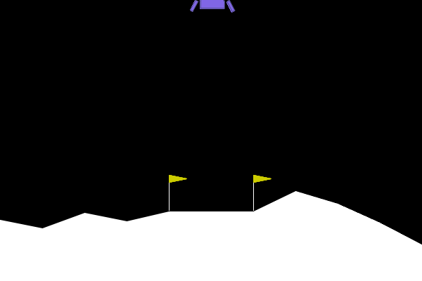
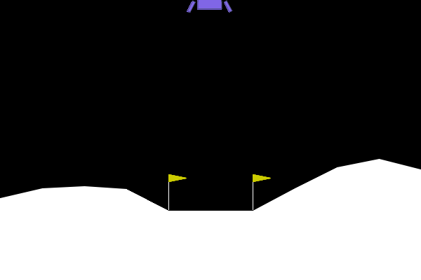
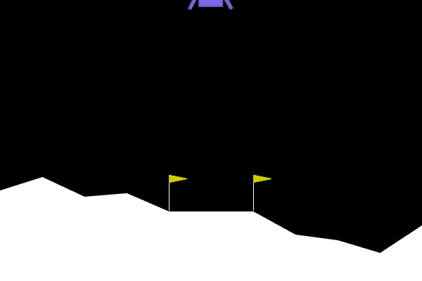

### Exercice 1:

Espace d'action (Moteurs) : Discrete(4)

--- RAPPORT DE VOL ---
Issue du vol : CRASH DÉTECTÉ 💥
Récompense totale cumulée : -108.89 points
Allumages moteur principal : 17
Allumages moteurs latéraux : 37
Durée du vol : 72 frames
Vidéo de la télémétrie sauvegardée sous 'random_agent.gif'

Un environnement est considéré “résolu” si le score moyen atteint **+200**. Ici, l’agent aléatoire obtient **-108.89** sur cet épisode, soit **308.89 points en dessous** du seuil. Il crash et consomme le carburant sans stratégie (moteur principal 17 fois, latéraux 37 fois).

[text](reward_hacker.py)

### Exercice 2:

--- RAPPORT DE VOL PPO ---
Issue du vol : CRASH DÉTECTÉ 💥
Récompense totale cumulée : -23.96 points
Allumages moteur principal : 145
Allumages moteurs latéraux : 109
Durée du vol : 256 frames
Vidéo de la télémétrie sauvegardée sous 'trained_ppo_agent.gif'

Comparaison vs agent aléatoire:
- Score : aléatoire = -108.89 vs PPO = -23.96 (meilleure performance, mais encore négative sur cet épisode)
- Carburant : PPO utilise beaucoup plus les moteurs (principal 145 vs 17, latéraux 109 vs 37), signe d’une stratégie plus “active” mais encore maladroite.
- Seuil +200 : non, sur cet épisode on est encore à 223.96 points sous le seuil (200 - (-23.96)).

### Exercice 3:

--- RAPPORT DE VOL PPO HACKED ---
Issue du vol : CRASH DÉTECTÉ 💥
Récompense totale cumulée : -107.70 points
Allumages moteur principal : 0
Allumages moteurs latéraux : 37
Durée du vol : 57 frames
Vidéo du nouvel agent sauvegardée sous 'hacked_agent.gif'

Stratégie adoptée par l’agent:
L’agent évite totalement le moteur principal (0 allumage). Il préfère ne presque jamais corriger verticalement et finit par crasher : c’est un comportement “radin” provoqué par la pénalisation artificielle.

 Explication (reward hacking):
L’agent maximise le retour cumulé \(G=\sum_t \gamma^t r_t\).  
Avec la récompense modifiée \(r'_t = r_t - 50 \cdot 1[a_t=2]\), chaque allumage du moteur principal coûte -50, ce qui domine la plupart des autres signaux.  
L’agent apprend donc qu’éviter l’action 2 est “optimal” pour maximiser \(G\) dans cet univers modifié, même si l’objectif réel (atterrir) est sacrifié : c’est du reward hacking.

### Exercice 4:

--- RAPPORT DE VOL PPO (GRAVITÉ MODIFIÉE) ---
Issue du vol : CRASH DÉTECTÉ 💥
Récompense totale cumulée : -162.30 points
Allumages moteur principal : 0
Allumages moteurs latéraux : 72
Durée du vol : 144 frames
Vidéo de la télémétrie sauvegardée sous 'ood_agent.gif'
(.venv) hanna@Mac TP5 % python ood_agent.py
--- ÉVALUATION OOD : GRAVITÉ FAIBLE ---

--- RAPPORT DE VOL PPO (GRAVITÉ MODIFIÉE) ---
Issue du vol : ATTERRISSAGE RÉUSSI 🏆
Récompense totale cumulée : 232.40 points
Allumages moteur principal : 39
Allumages moteurs latéraux : 310
Durée du vol : 500 frames
Vidéo de la télémétrie sauvegardée sous 'ood_agent.gif'

Observation (OOD = gravité -2):
Les résultats sont instables : sur certains épisodes l’agent crash (ex. -162.30), et sur d’autres il parvient à réussir (+232.40) mais avec un comportement très différent (durée max 500 frames, énormément de corrections latérales 310).  
Cela montre une robustesse partielle : la policy n’est pas calibrée pour cette dynamique, et selon l’état initial elle peut soit dériver/crasher, soit “s’en sortir” au prix d’un contrôle inefficace.

Explication technique: 
Changer la gravité modifie la dynamique \(P(s_{t+1}\mid s_t,a_t)\) (vitesses, temps de freinage, stabilité).  
La policy PPO a appris des seuils implicites adaptés à gravité ~ -10 ; en -2, les mêmes actions entraînent des trajectoires différentes → sur/sous-compensation, dérive horizontale, oscillations, et donc performance variable (OOD / sim-to-real gap).

### Exercice 5
Stratégie 1: Domain Randomization (entraînement sur une distribution de physiques)
Au lieu d’entraîner PPO sur une seule gravité, j’entraîne sur une famille d’environnements : à chaque épisode (reset), je tire aléatoirement `gravity` (ex. uniforme dans [-12, -2]) et j’ajoute des variations de vent (`wind_power`, `turbulence_power`) + éventuellement un léger bruit sur les observations.  
Objectif : apprendre une politique qui maximise l’espérance de récompense sur plusieurs physiques, donc plus robuste OOD, sans stocker un modèle par lune.

Stratégie 2: Curriculum Learning (progressif pour stabiliser l’apprentissage)
Je commence par entraîner sur la physique nominale (gravité -10, vent faible ou nul), puis j’augmente progressivement la difficulté : élargir la plage de gravité (ex. -10 → [-10,-6] → [-12,-2]) et activer le vent/turbulence petit à petit.  
Objectif : éviter l’échec de convergence qu’on observe quand on randomise trop fort dès le début, tout en obtenant une policy robuste.

(Optionnel) Stratégie 3: Policy “conditionnée” par les paramètres physiques
Sans changer d’algorithme, je fournis à la policy des informations sur la physique (ex. valeur de gravité/vent) en les ajoutant à l’observation (ou en normalisant les observations en conséquence).  
Objectif : permettre à un *seul* modèle PPO d’adapter ses actions selon les paramètres de l’environnement (contrôle adaptatif), au lieu d’appliquer une stratégie “fixe” calibrée sur une seule gravité.

### Conclusion globale 

- Agent aléatoire : très loin du seuil (+200), crash et consommation sans stratégie.
- PPO : améliore le score mais peut rester instable / non résolu sur un épisode.
- Reward hacking : en modifiant la récompense, l’agent optimise la règle plutôt que l’objectif.
- OOD : changement de gravité → performance instable, illustrant le sim-to-real gap ; nécessité de stratégies de robustesse (domain randomization, curriculum…).