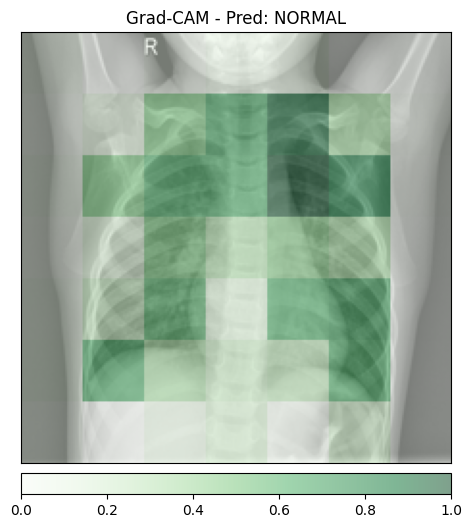
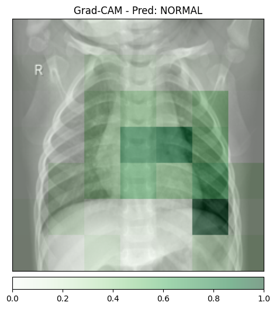
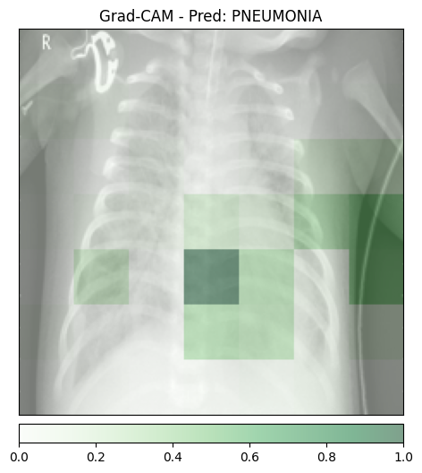
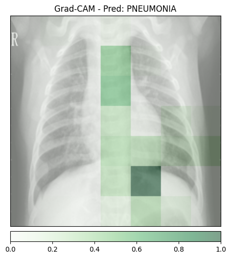
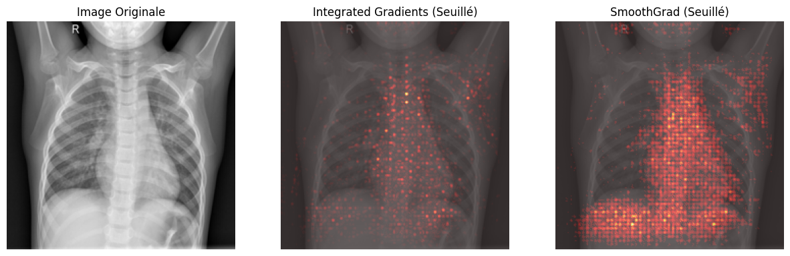
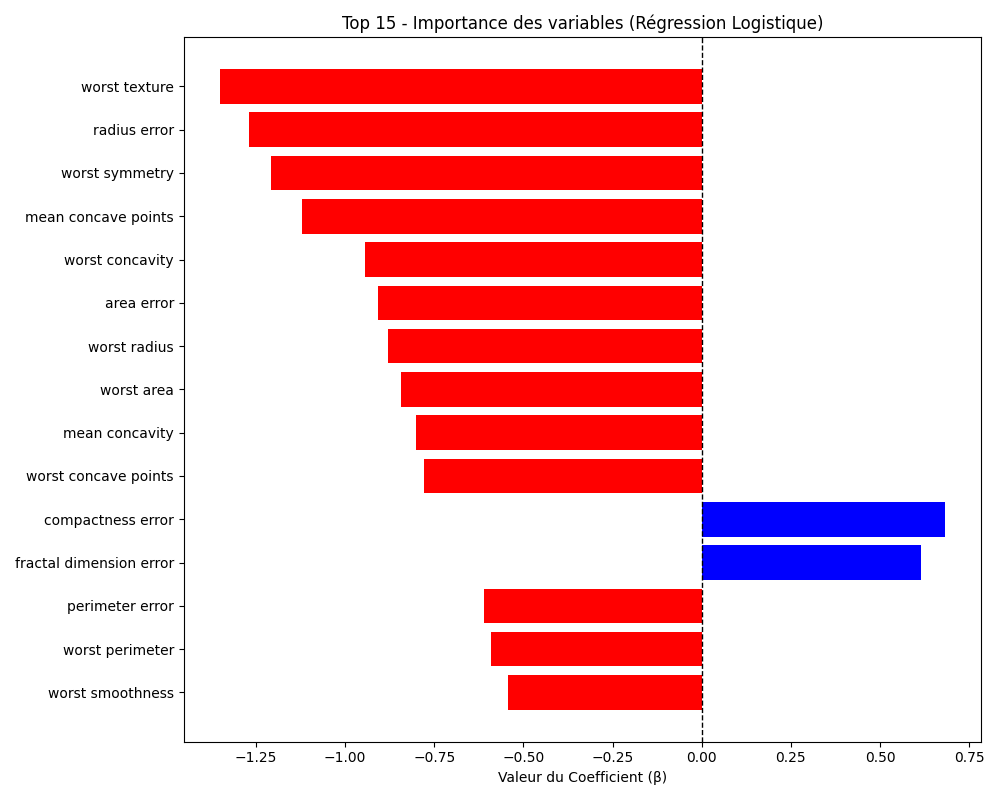
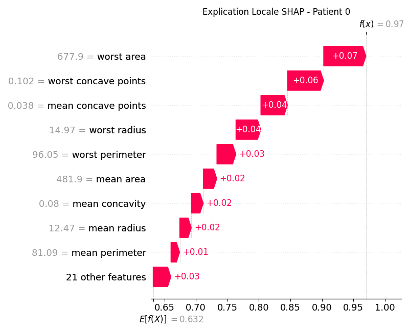
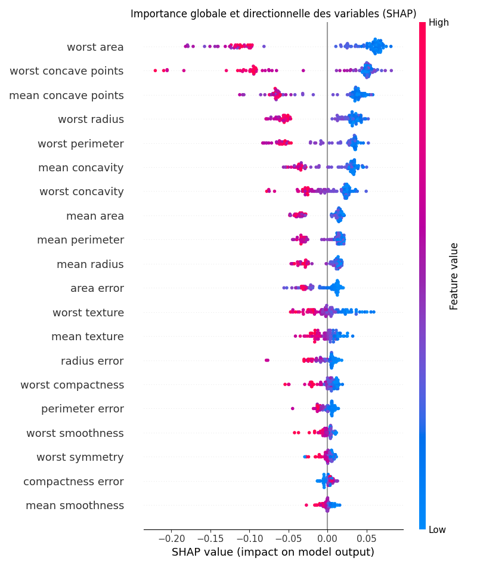

Exercice 1:

On a les quatres images suivantes:

Analyse des faux positifs (Clever Hans)
Sur normal_1 et normal_2, le modèle prédit NORMAL : je n’observe donc pas ici le faux positif attendu (“PNEUMONIA” sur une image saine).
Cela dit, la Grad-CAM est informative : l’activation se concentre surtout sur la région thoracique (champs pulmonaires / médiastin), et pas sur des éléments non médicaux (texte, marqueur “R”, coins, bordures). Sur ces exemples, le modèle semble donc s’appuyer sur de l’anatomie plutôt que sur un artefact évident.
À noter : sur les images pneumonie, certaines activations débordent vers des zones peu informatives (bords/fond), ce qui peut indiquer un biais de cadrage (contraste, collimation, exposition, padding). Ce n’est pas une preuve, mais c’est typiquement le type d’indice à surveiller pour un effet Clever Hans.

Granularité / résolution (pourquoi c’est en gros blocs)
La Grad-CAM apparaît en gros blocs flous car elle est calculée sur la dernière couche convolutionnelle du ResNet, où la résolution spatiale a été fortement réduite par les downsampling (strides/pooling) : on passe d’une image haute résolution à une feature map très petite (souvent ~7×7).
La heatmap est ensuite interpolée pour l’affichage : ça agrandit la carte mais n’ajoute aucun détail, d’où l’aspect “bloc”. En plus, à ce niveau, chaque cellule a un grand champ réceptif, donc l’explication est naturellement plus globale que précise au pixel.

Exercice 2:

Sur mon exécution, Integrated Gradients prend environ 3.66 s (50 étapes), alors qu’une inférence est quasi instantanée à l’échelle humaine. En revanche, SmoothGrad est extrêmement coûteux : avec 100 échantillons, le temps monte à environ 553.23 s (≈ 9 minutes). Ce surcoût est attendu, car SmoothGrad répète l’explication IG sur de nombreuses versions bruitées de l’image.
Conclusion : générer SmoothGrad de manière synchrone au premier clic d’analyse d’un médecin n’est pas réaliste en pratique (latence beaucoup trop élevée).
Architecture logicielle (1 phrase) : retourner immédiatement la prédiction, puis calculer l’explication en asynchrone via une file de tâches (queue) traitée par des workers GPU, et afficher la heatmap dès qu’elle est prête (avec cache si l’image est redemandée).

Intérêt d’une carte sous zéro (vs ReLU de Grad-CAM)
Une attribution signée (valeurs positives et négatives) permet de distinguer les pixels qui augmentent la probabilité de la classe cible (contribution positive) de ceux qui la diminuent (contre-évidence, contribution négative). À l’inverse, Grad-CAM applique un ReLU qui supprime les contributions négatives : on ne voit que les indices “pour” la classe, et on perd l’information sur ce qui s’oppose à la décision.

Exercice 3:

Feature la plus déterminante vers “Maligne” (classe 0) : worst texture. Sur ton graphe, c’est le coefficient le plus négatif (barre rouge la plus longue vers la gauche), donc c’est la variable qui tire le plus fortement la prédiction vers maligne quand elle augmente (à données normalisées).
Pourquoi c’est un vrai “glass-box” (vs post-hoc) : avec une régression logistique, l’explication est intégrée au modèle : chaque coefficient correspond directement à l’effet d’une variable sur le score (et donc sur la classe). On obtient une interprétation globale, stable et immédiate (quelles features comptent et dans quel sens), sans générer d’attributions a posteriori, sans méthodes approximatives, et sans coût de calcul supplémentaire comme Grad-CAM/IG/SHAP.

Exercice 4:

Explicabilité globale (Summary Plot).
Les 3 variables les plus importantes selon SHAP sont worst area, worst concave points et mean concave points. Elles recoupent bien ce qu’on voyait déjà en régression logistique (notamment les variables liées à la concavité / concave points et à la taille/aire). On peut donc en déduire que ces caractéristiques sont des biomarqueurs robustes : elles restent fortement discriminantes même quand on change de famille de modèle (linéaire → forêt), ce qui suggère que le signal est réel et pas un artefact de modélisation.
Explicabilité locale (Waterfall Plot — patient 0).
La feature qui contribue le plus à la prédiction finale est worst area, avec une valeur exacte de 677.9 pour le patient 0.